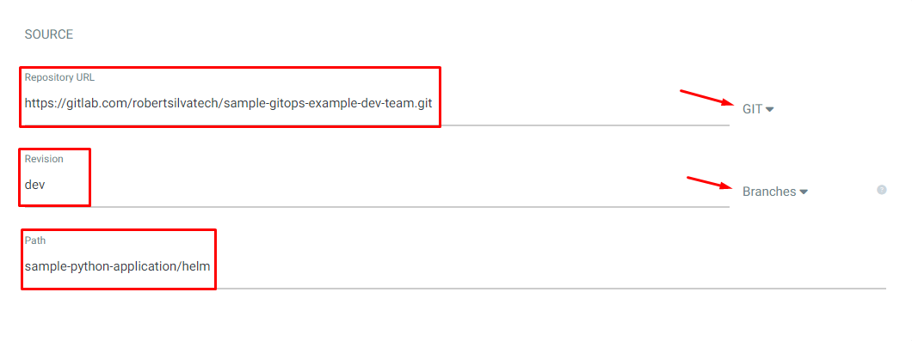
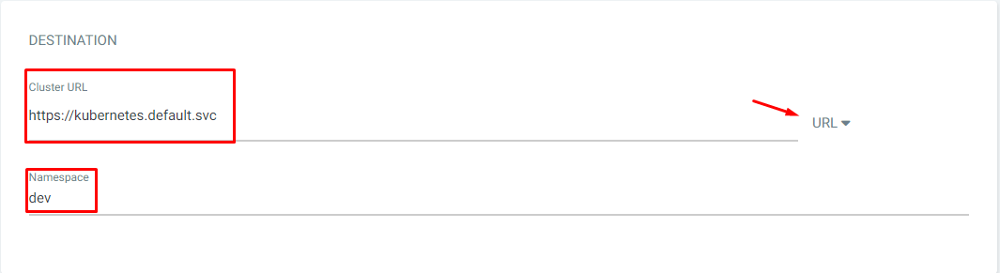
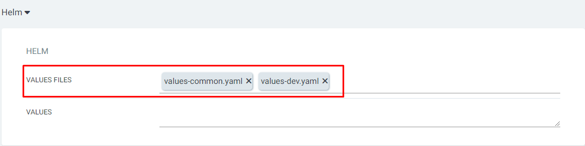
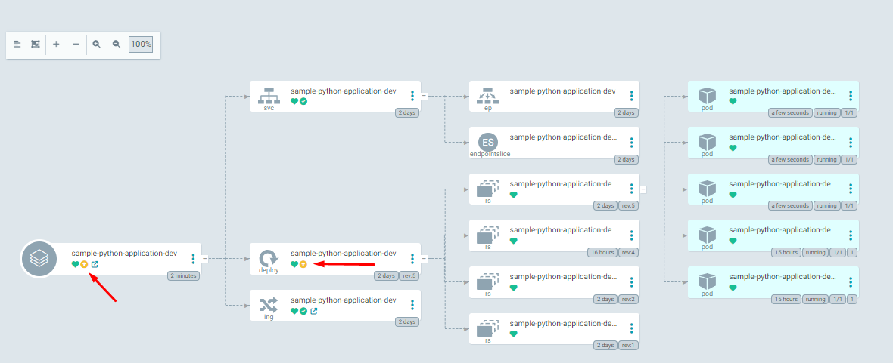

# ArgoCD

## Passo 01 - Instalação do GitOps

- Criando o namespace do ArgoCD
```
kubectl create namespace argocd
# listando os namespaces
kubectl get namespace argocd
```

- Instalando o ArgoCD
```
kubectl apply -n argocd -f https://raw.githubusercontent.com/argoproj/argo-cd/stable/manifests/install.yaml
# listando os recursos criados
kubectl get all -n argocd
```

- Criando um Ingress Resource

> Considerando que você já tem o ingress funcionando no seu cluster

```
kubectl apply -n argocd -f ingress.yaml
# listando os ingress
kubectl get ingress -n argocd
# verificando detalhes do ingress
kubectl describe ingress argocd-server-http-ingress -n argocd
```

- Recuperando a senha inicial

```
kubectl -n argocd get secret argocd-initial-admin-secret -o jsonpath="{.data.password}" | base64 -d
```

- Acesse via browser

https://seuhost

> Usuário padrão é `admin`

## Passo 02 - Conhecendo nossa aplicação em Python

- Repositório: https://gitlab.com/robertsilvatech/sample-python-application

## Passo 03 - Conhecendo nosso repositório do GitOps

- Repositório: https://gitlab.com/robertsilvatech/sample-gitops-example-dev-team

## Passo 04 - Configurando nossa primeira App no ArgoCD

### Configurando uma nova App

General  


> O `dev` no final do nome da aplicação já indica que iremos fazer o deploy separado por ambientes e facilita a identificação posterior dentro do argo.  

Source  


Destination  


Helm  


Clique em **Create**

## Passo 05 - Simular alterações com o `auto sync` desabilitado.

- Aumente o número de replicas do deployment

```
kubectl -n dev scale deployment sample-python-application-dev --replicas 5
```

- Veja o argo OutOfSync



